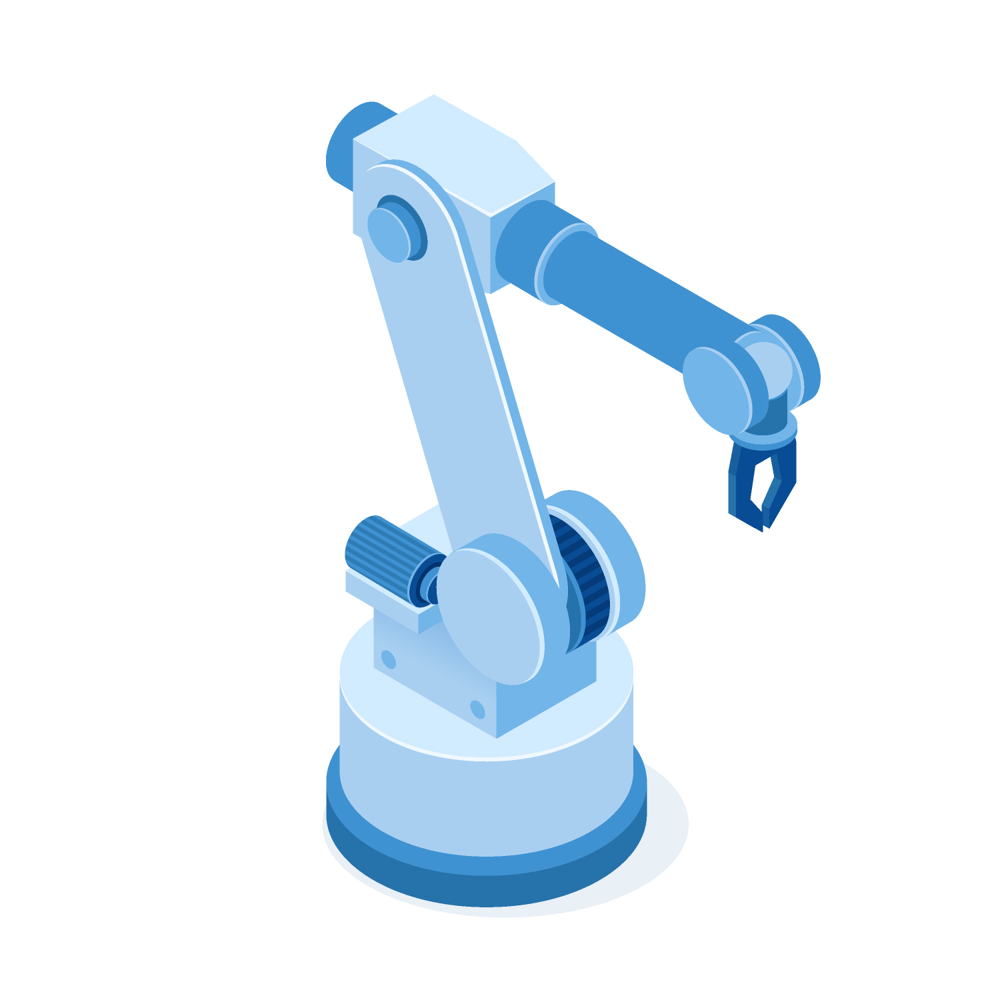
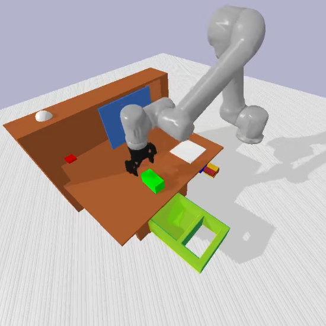

# Learning from Play

<!--
*** Thanks for checking out the Best-README-Template. If you have a suggestion
*** that would make this better, please fork the repo and create a pull request
*** or simply open an issue with the tag "enhancement".
*** Thanks again! Now go create something AMAZING! :D
***
***
***
*** To avoid retyping too much info. Do a search and replace for the following:
*** sholtodouglas, learning_from_play, twitter_handle, email, project_title, project_description
-->

<!-- PROJECT SHIELDS -->
<!--
*** I'm using markdown "reference style" links for readability.
*** Reference links are enclosed in brackets [ ] instead of parentheses ( ).
*** See the bottom of this document for the declaration of the reference variables
*** for contributors-url, forks-url, etc. This is an optional, concise syntax you may use.
*** https://www.markdownguide.org/basic-syntax/#reference-style-links
-->
[![Contributors][contributors-shield]][contributors-url]
[![Forks][forks-shield]][forks-url]
[![Stargazers][stars-shield]][stars-url]
[![Issues][issues-shield]][issues-url]
[![MIT License][license-shield]][license-url]

<!-- PROJECT LOGO -->
 

  <a href="https://github.com/sholtodouglas/learning_from_play">
    
	<!-- Hand vector created by upklyak - www.freepik.com -->
  </a>

  <h3 align="center">Learning From Play</h3>

  

    Bringing self-supervised learning to multi-task robotic manipulation.
     
    <a href="https://github.com/sholtodouglas/learning_from_play"><strong>Explore the docs »</strong></a>
     
     
    <a href="https://github.com/sholtodouglas/learning_from_play">View Demo</a>
    ·
    <a href="https://github.com/sholtodouglas/learning_from_play/issues">Report Bug</a>
    ·
    <a href="https://github.com/sholtodouglas/learning_from_play/issues">Request Feature</a>
  

<!-- TABLE OF CONTENTS -->

  
<h2 style="display: inline-block">Table of Contents</h2>

  <ol>
    <li>
      <a href="#about-the-project">About The Project</a>
      <ul>
        <li><a href="#built-with">Built With</a></li>
      </ul>
    </li>
    <li>
      <a href="#getting-started">Getting Started</a>
      <ul>
        <li><a href="#installation">Installation</a></li>
      </ul>
    </li>
    <li><a href="#usage">Usage</a></li>
    <li><a href="#roadmap">Roadmap</a></li>
    <li><a href="#contributing">Contributing</a></li>
    <li><a href="#license">License</a></li>
    <li><a href="#contact">Contact</a></li>
    <li><a href="#acknowledgements">Acknowledgements</a></li>
  </ol>

<!-- ABOUT THE PROJECT -->
## About The Project
<!--  -->

	

### Built With

* [Tensorflow 2](https://github.com/tensorflow/tensorflow)
* [PyBullet](https://github.com/bulletphysics/bullet3/tree/master/examples/pybullet)

# Data collection
- There are two options here. 1. Full teleoperation in 'data_collection/vr_data_collection.py' 2. Scripted data collection (where it does some simple scripted commands, e.g top down block grasping, and door/drawer manipulation). Scripted data collection is a good way to test if the model can learn basic non-diverse motions, but a strong model needs teleoperated data - as a result only the teleoperated pathway is up to date, we last used scripted ~2 months ago and have not tested it since. 
- To teleoperate, you'll need to set up pyBullet VR https://docs.google.com/document/d/1I4m0Letbkw4je5uIBxuCfhBcllnwKojJAyYSTjHbrH8/edit?usp=sharing, then run the 'App_PhysicsServer_SharedMemory_VR' executable you create in that process, then run 'data_collection/vr_data_collection.py'. The arm will track your controller, the main trigger will close the gripper and the secondary trigger will save the trajectory you have collected. We save 'full state' not images during data collection - because this allows us to determinstically reset the environment to that state and then collect images from any angle desired!
- The npz files created during this process are converted to tf records using 'notebooks/Creating_tf_records'
- This isn't the easiest of processes, so here is a link to the validation dataset https://drive.google.com/drive/folders/1AoN9grOONiO4tT12mXKvW1arB5suk7Bo?usp=sharing.

# Training
- To train a model on Colab, use  notebooks/train_lfp.ipynb, which will walk you through hardware specific setup (GCS/GDRIVE/Local and TPU/GPU), creating the dataloader and models, using the trainer class and logging to WandB or Comet. 
- To train a model on GCP, follow 'useful_commands.md'. The first commands should be entered into GCP's console - then once your TPU instance is created use the GCP 'compute' pane to SSH in and follow the remaining steps (which clone the repo, install the dependencies and launch a basic deterministic model. Before training a model on GCP, you'll need to set up a GCS bucket to store data in and save model weights - the name of this bucket is defined at the top of 'useful_commands.md'. You'll see that we've created two buckets, one in Iowa (as Colab's TPUs are all hosted there) and one in Groningen (as our allocation of TFRC TPUs is hosted there).
- Particular args which you may want to modify are: -tfr (looks for tfrecords in the data folder instead of npz, necessary for GCS), -i (images) -n (if not none, it makes the model probabilistic) 

# Deploying
- Contact us if you'd like a pretrained model and we'll link you to the latest. 
- Once you've trained a model, download it into the 'saved_models' folder. 
- Run the notebooks/deploy notebook with the same args defined in the first cell as you trained with. 
- This notebook walks you through some pre-checks (it'll plot trajectory reconstructions to make sure the model's outputs make sense, and plot the latent space), then opens up the environment and has two ways of testing the environment. 1. By taking examples from the validation set, and initialising the environment to the first state and setting the final state as goal. 2. By resetting randomly, and using a tester class to generate goals from a predefined set (e.g, door left, block shelf). These goals will adjust the environment to ensure the test is valid (e.g, the door left test will make sure the door is on the right side of the cupboard).
- The deploy notebook also does some of the tests which feature in our blog post. It uses the goal set testing method to load in different models and test them against a set of goals, it generates adversarial blocks to test robustness and it allows for save/replay of trajectories while displaying the latent space to visualise the plan sampling. 

<!-- LICENSE -->
## License

Distributed under the MIT License. See `LICENSE` for more information.

<!-- CONTACT -->
## Contact

* Sholto Douglas - [@\_sholtodouglas](https://twitter.com/_sholtodouglas) - sholto.douglas1[at]gmail.com
* Tristan Frizza - [@tristanvtx](https://twitter.com/tristanvtx) - tfrizza[at]gmail.com

Project Link: [https://github.com/sholtodouglas/learning_from_play](https://github.com/sholtodouglas/learning_from_play)

<!-- MARKDOWN LINKS & IMAGES -->
<!-- https://www.markdownguide.org/basic-syntax/#reference-style-links -->
[contributors-shield]: https://img.shields.io/github/contributors/sholtodouglas/learning_from_play.svg?style=for-the-badge
[contributors-url]: https://github.com/sholtodouglas/learning_from_play/graphs/contributors
[forks-shield]: https://img.shields.io/github/forks/sholtodouglas/learning_from_play.svg?style=for-the-badge
[forks-url]: https://github.com/sholtodouglas/learning_from_play/network/members
[stars-shield]: https://img.shields.io/github/stars/sholtodouglas/learning_from_play.svg?style=for-the-badge
[stars-url]: https://github.com/sholtodouglas/learning_from_play/stargazers
[issues-shield]: https://img.shields.io/github/issues/sholtodouglas/learning_from_play.svg?style=for-the-badge
[issues-url]: https://github.com/sholtodouglas/learning_from_play/issues
[license-shield]: https://img.shields.io/github/license/sholtodouglas/learning_from_play.svg?style=for-the-badge
[license-url]: https://github.com/sholtodouglas/learning_from_play/blob/master/LICENSE
[linkedin-shield]: https://img.shields.io/badge/-LinkedIn-black.svg?style=for-the-badge&logo=linkedin&colorB=555
[linkedin-url]: https://linkedin.com/in/sholtodouglas
