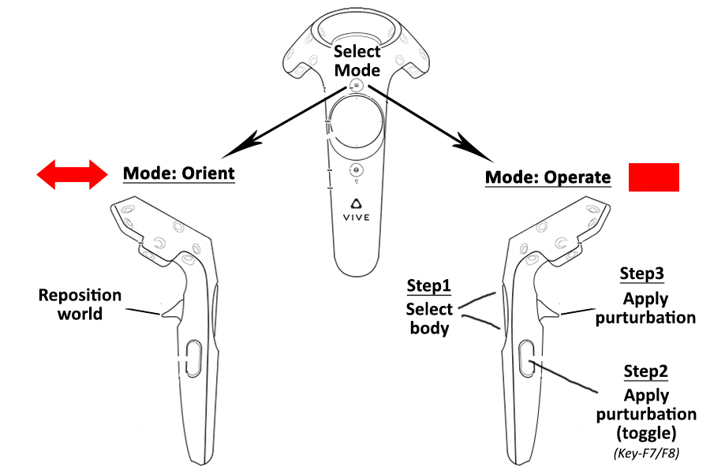

# PUPPET installation

## Requirements
Vive headset and a minimum of one active controller. Optional equipments include additional vive controllers, vive trackers, and cyberglove.

## Build and install
1. Add environment variable ["MUJOCOPATH"](..//gallery//adding_system_variables.jpg) to the `System Properties`
2. Open `x64 Native Tools Command Prompt` from visual studios.
3. Type `SET MUJOCOPATH` to verify that the path is correctly set.
3. Navigate to `build/` folder.
4. Type `nmake` to build and install the project. It will compile two programs `puppet.exe` and `playlog.exe`.
5. Use `nmake clean` if you need to clean the project installation. Note it doesn't clear recorded logs.

## Usage
1. puppet.exe is used for emersive visualization and interaction with the mujoco worlds.
2. playlog.exe is can be used to replay recorded logs and dump raw video (Key F9 to start stop video recording) (pixel_format rgb24).   

Navigate to `build/` folder. Type `puppet.exe` or `playlog.exe` (without any arguments) for respective usage instructions. 

**Note1**: Logs are dumped in mujoco's .mjl format. Refer [Mujoco documenation](http://www.mujoco.org/book/haptix.html#uiRecord) for details.  
**Note2**: You can use [ffmpeg](https://ffmpeg.org/) to convert the raw video. Ensure that the video resolution and fps matches with the settings used while dumping raw video.
```
ffmpeg -f rawvideo -pixel_format rgb24 -video_size 800x800 -framerate 60 -i rgb.out -vf "vflip" video.mp4
```


## Bindings
### Controller
<p align="center"></p>

Controller have two modes

1. **Orient**:  Move and reposition the world with respect to the user
    * __trigger__ - Engage repositioning
    * __up/F8__      - Toggle mocap1
    * __down/F7__    - Toggle mocap0
    * __right/F6__   - Toggle log saving
    * __left/backspace__    - Reset the world (optionally save logs, if recorded) 

2. **Operate**:  TeleOperate the scene via controller/ trackers/ external devices
    * __Step1__ - Use the up/down pad button to select the body of interest 
    * __Step2__ - Use the side button to toggle between purturbation and no purturbation
    * __Setp3__ - Use the trigger to apply special purturbation
    * __Step4__ - Use the left pad button to reset the world


### Keyboard
In addiiton to the usual Mujoco key bindings following Puppet specific bindings are available. 
* __F6__ - Dump logs toggle
* __F7__ - Bind controller0 toggle
* __F8__ - Bind controller1 toggle
* __F9__ - Video recording toggle (only in `playlog.exe`)


## Special cases 

### Controller/Mocap configuration
Am xml with a mocap body called "mocap0/mocap1" gets associated with controller0/controller1 and places the controller in the "vTOOL_PULL" mode.

### Fetch
While the vive driver is general purpose, There are fetch-gripper specific utilities that are provided if the xml loaded has two actuators with following names: "r_gripper_finger_joint" and "l_gripper_finger_joint"

## Trouble shooting 
1. Vive tracker not detected? - you need to add Vive Tracker into SteamVR. Rightclick on one of the existing controller’s icon and click “Pair Controller” in the pop-up menu. Press the Power button on Vive Tracker for 2 seconds, and then release it to enter the paring mode. Note that if you have two Vive controllers already, then you will need to plug the dongle into the dongle cradle to PC’s USB port. More details can be found here [Vive Tracker developer guide](https://dl.vive.com/Tracker/Guideline/HTC_Vive_Tracker_Developer_Guidelines_v1.3.pdf)
2. Vive-chaperone is in your view? - Vive doesn't allow you to fully disable the chaperon from the scene. However the chaperone can be removed from the view by tuning its alpha value to zero. Restart steaemVR for the new settings to take effect. 
```
C:\Program Files (x86)\Steam\config\steamvr.vrsettings\collisionBounds: "CollisionBoundsColorGammaA" : 0
``` 
